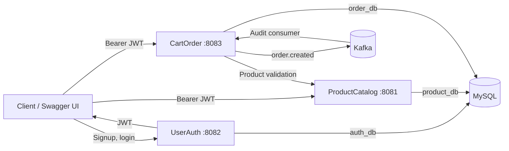

# Ecommerce Backend Capstone

A three-service ecommerce backend built with Spring Boot. The project demonstrates JWT
authentication, product management, cart operations, transactional checkout, simulated payments,
order history, and Kafka-based order events.

Checkout is the primary workflow: it revalidates current product prices and stock, calculates the
payable amount on the server, snapshots delivery and product data, processes a simulated payment,
and publishes an event only after successful completion.

## Architecture



| Service | Responsibility | Port |
|---|---|---:|
| `UserAuth` | Signup, login, JWT issuance, current user | `8082` |
| `ProductCatalog` | Product CRUD, listing, search, filtering, stock | `8081` |
| `CartOrder` | Cart, checkout preview, payment simulation, orders, events | `8083` |

Infrastructure includes MySQL 8.4, Kafka, ZooKeeper, and Kafka UI.

## Key Features

- JWT authentication shared across all three services
- BCrypt password hashing and Flyway-managed authentication schema
- Seeded product catalog with pagination, sorting, search, and category filtering
- User-specific cart management
- Checkout preview with current product price and stock validation
- Server-calculated subtotal, discount, shipping, tax, and final payable amount
- Validated shipping-address snapshot stored with each order
- Product and price snapshots preserved in order items
- Correct payment state handling: failed payment leaves the cart active
- Pessimistic cart locking to reduce concurrent duplicate checkouts
- Kafka `order.created` event published only after successful checkout
- Swagger/OpenAPI documentation for every service
- H2-backed ProductCatalog and CartOrder tests that run without Docker or MySQL

## Technology

- Java 17
- Spring Boot 3.4.4
- Spring Security and JWT
- Spring Data JPA / Hibernate
- MySQL and H2
- Flyway
- Apache Kafka
- Gradle
- Docker Compose
- Springdoc OpenAPI
- JUnit 5, Mockito, AssertJ, and JaCoCo

## Repository Setup

The three services are Git submodules. Clone them with the parent repository:

```bash
git clone --recurse-submodules https://github.com/ajz007/ecommerce-capstone.git
cd ecommerce-capstone
```

For an existing clone:

```bash
git submodule update --init --recursive
```

## Run With Docker

Prerequisite: Docker Desktop or Docker Engine with Compose.

```bash
docker compose up --build
```

The first startup can take a few minutes while images and Gradle dependencies are downloaded.
MySQL data is retained in the `mysql-data` Docker volume.

### Service URLs

| Component | URL |
|---|---|
| Product Catalog Swagger | http://localhost:8081/swagger-ui/index.html |
| User Auth Swagger | http://localhost:8082/swagger-ui/index.html |
| Cart and Order Swagger | http://localhost:8083/swagger-ui/index.html |
| Kafka UI | http://localhost:8090 |
| MySQL | `localhost:3333` |
| Kafka external listener | `localhost:9094` |

## Demo Credentials

Docker Compose enables a local demo account:

```text
Email: demo@example.com
Password: password123
```

The account is disabled by default outside the Docker Compose configuration. Do not use the
development JWT secret or demo credentials in a production environment.

## Demo Workflow

1. Log in through `POST /auth/login` and copy the returned `accessToken`.
2. Authorize Swagger with `Bearer <accessToken>`.
3. Browse products through `GET /products`.
4. Add a product through `POST /cart/items`.
5. Review the active cart through `GET /cart`.
6. Preview the payable amount through `GET /checkout/preview`.
7. Submit payment method and shipping address through `POST /checkout`.
8. View the completed order through `GET /orders/{orderId}`.
9. Inspect the `order.created` event in Kafka UI.

The client never submits product prices or the payable amount. CartOrder calculates them from the
current catalog data to prevent client-side price manipulation.

See [Demo Flow](docs/DEMO-FLOW.md) for complete `curl` examples.

## Main APIs

### Authentication

- `POST /auth/signup`
- `POST /auth/login`
- `GET /auth/me`

### Product Catalog

- `GET /products`
- `GET /products/{id}`
- `GET /products/categories`
- `POST /products`
- `PUT /products/{id}`
- `DELETE /products/{id}`

### Cart, Checkout, and Orders

- `POST /cart/items`
- `GET /cart`
- `PUT /cart/items/{itemId}`
- `DELETE /cart/items/{itemId}`
- `DELETE /cart`
- `GET /checkout/preview`
- `POST /checkout`
- `GET /orders`
- `GET /orders/{orderId}`

Except for signup, login, and Swagger/OpenAPI resources, application endpoints require:

```text
Authorization: Bearer <jwt>
```

See [API Summary](docs/API-SUMMARY.md) for the endpoint index.

## Checkout Behavior

Before creating an order, CartOrder:

1. Locks and loads the authenticated user's active cart.
2. Rejects missing or empty carts.
3. Fetches current product details from ProductCatalog.
4. Rejects unavailable products or insufficient stock.
5. Recalculates item totals using current server-side prices.
6. Calculates tax, shipping, discount, and final payable amount.
7. Stores immutable product, amount, and shipping-address snapshots.
8. Simulates payment and records the transaction.
9. Marks the cart checked out and publishes `order.created` only on success.

The tax rate and shipping fee are configurable. Discount is currently represented in the amount
breakdown but defaults to zero.

## Configuration

Common environment variables:

- `SERVER_PORT`
- `DB_HOST`
- `DB_PORT`
- `DB_NAME`
- `DB_USER`
- `DB_PASSWORD`
- `JWT_SECRET`
- `JWT_EXPIRATION_SECONDS`

Additional variables:

- `DEMO_USER_ENABLED`
- `PRODUCT_CATALOG_BASE_URL`
- `CHECKOUT_TAX_RATE`
- `CHECKOUT_SHIPPING_FEE`
- `KAFKA_BOOTSTRAP_SERVERS`
- `KAFKA_CONSUMER_GROUP_ID`
- `KAFKA_TOPIC_ORDER_CREATED`

Local defaults are provided for development. Docker Compose supplies service-to-service hostnames
and a shared JWT secret.

## Databases

One MySQL container hosts three logical databases:

- `auth_db`
- `product_db`
- `order_db`

They are created by [docker/mysql/init/01-create-databases.sql](docker/mysql/init/01-create-databases.sql).

## Tests

Run tests from each service directory.

Windows:

```powershell
cd UserAuth
.\gradlew.bat test

cd ..\ProductCatalog
.\gradlew.bat test

cd ..\CartOrder
.\gradlew.bat test
```

Linux/macOS:

```bash
(cd UserAuth && ./gradlew test)
(cd ProductCatalog && ./gradlew test)
(cd CartOrder && ./gradlew test)
```

`ProductCatalog` and `CartOrder` use H2 for tests. `UserAuth` enforces at least 80% JaCoCo coverage
on its configured application classes.

## Documentation

- [High-Level Design](docs/HLD.md)
- [API Summary](docs/API-SUMMARY.md)
- [Demo Flow](docs/DEMO-FLOW.md)

## Scope

Payments are deliberately simulated so the project can demonstrate payment and order state
transitions without external credentials. Production concerns such as a real payment gateway,
idempotency keys, inventory reservation, distributed tracing, and a transactional outbox are
appropriate future extensions.
